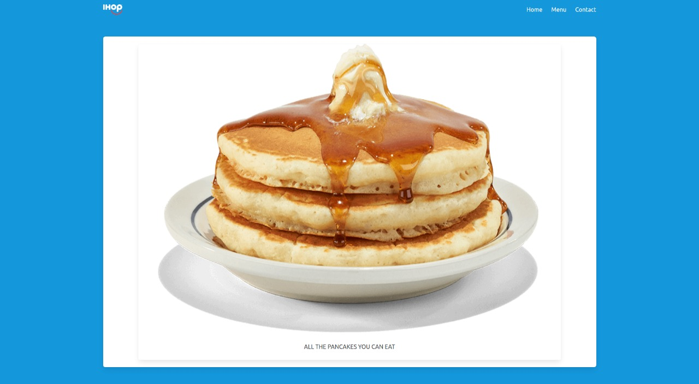

# Restaurant-page
A simple restaurant page,  I used JavaScript alone to generate the entire contents of the website. The scope of this project is a deeper understanding of Webpack and DOM manipulation with JS.




## Live demo

[live demo](https://mricanho.github.io/Restaurant-page/)

## Built With

- JavaScript
- HTML
- Webpack
- Bulma

## How to start the project from your Local enviroment

- Open your terminal and cd where you want to store the project
- Run the following command:
```bash
https://github.com/mricanho/Restaurant-page.git
```
- CD to the directory where you create the clone repository.
- Run:
```bash
npm run build
```
- Open the live server on your VScode `Alt + L` then `Alt + o`

## Author

👤 **Miguel Ricaño**

- Github: [@mricanho](https://github.com/mricanho)
- Linkedin: [Miguel Ricaño](https://www.linkedin.com/in/mricanho/)

## 🤝 Contributing

Contributions, issues and feature requests are welcome!

## Show your support

Give a star if you :star: like this project!

## Acknowledgments

- Microverse
- TheOdinProject
